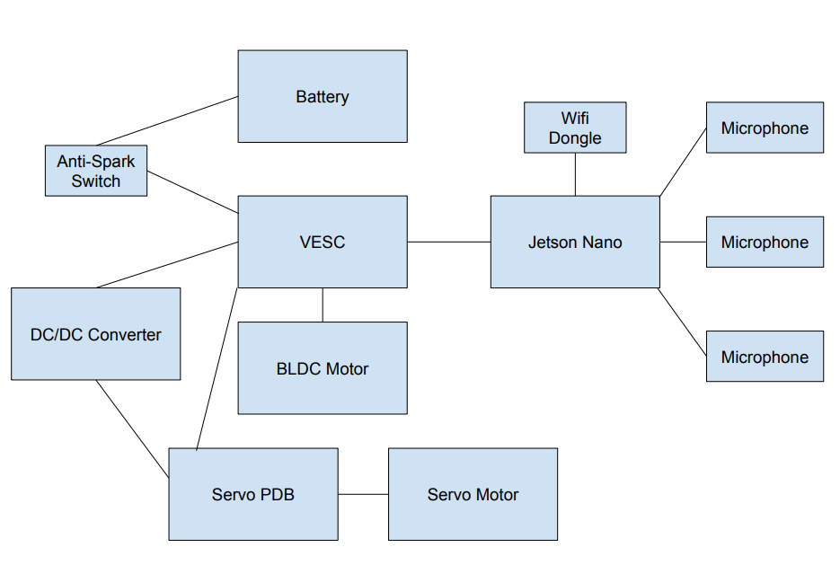

# Team 4 Final Project Report
## Members: Vasanth Senthil (ECE), Eddy Rodas Lima(MAE), Lingpeng Meng(ECE)

## Physical Setup

## Initial Goals

### Objective
- Make our RoboCar follow sound using sound localization from multiple microphones.

### Must Haves
- Car is able to determine approximate direction of an audio source
- Car moves in towards audio source once direction of audio is determined

### Nice to Haves
- Car follows specific audio signals (eg. someone’s voice) rather than based on volume
- Accurate movement towards source

## Accomplishments
- Researched and experimented with different methods of sound localization, such as using time of arrival delay between microphones
- Used the pyaudio library to collect streams of microphone data from each of the three microphone, and processed this data in order to tell direction real-time based on sound level
- Used the pyvesc library to create a custom movement file that allows us to easily move the RoboCar based on provided angles and throttle until specified conditions are met
- The microphone processing file called upon the movement functions after determining current direction.
- We also spread the left and right microphones to minimize the noise created by the car’s movement, which would influence the accuracy of direction calculations.

## Demo Videos

- [Static Source Left](https://drive.google.com/file/d/13TPnEzKm20CxKEgk1pcJPanVXwo76LHR/view?usp=sharing)
- [Static Source Right](https://drive.google.com/file/d/1RG1UuX8P4VvnZBoXVOWmsjo4cacDzP8C/view?usp=sharing)
- [Moving Source Front](https://drive.google.com/file/d/1Pw_WStrDUOS22UNbzJ1TFVewrz1A_-WW/view?usp=sharing)
- [Moving Source Back](https://drive.google.com/file/d/1W-DCwXSt74gN0Jc4fxbKCT6tJacsEI6T/view?usp=sharing)
- [Moving Source Further Away](https://drive.google.com/file/d/1RHpWl3BkbbCh-zH4dtLjfAjUZcEjVYKg/view?usp=sharing)

## Issues Faced

| Issue  | Solution |
| ------------- | ------------- |
| Original idea of using time delay between microphones was not possible due to jetson limitations (discussed further on next slide)
  | Decided to use volume of sound signals instead of microphone timing in order to determine direction of audio.
  |
| Sound from car’s movement, such as servo motors and wheels, were causing our robot to turn randomly.
  | Created wings out of cardboard which lifted and spread out the left/right microphones away from the wheels.
  |
| Random/sudden loud noises from the environment made the car turn in wrong directions, even when originally was moving correctly towards audio source.
  | Averaged the audio signals of each microphone over the last few ticks using a buffer in order to reduce impact of outlier noises. Required tuning, as a small buffer would not remove outliers as effectively while a large buffer reduced reaction time of robot’s movement when direction of audio actually changed
  |

## What did not work

- Original plan was to use the time delay between when microphones head a noise over a sound threshold in order to calculate angle of sound. Problem with that is the Jetson Nano is running Linux, and due to background processes and overhead, it is not precise enough to identify the timing needed for this method to work when the microphones are this close together. This may have been possible with a real-time system such as an Arduino
- Another method was using real-time localized sound by performing beamforming using microphones in array, but we were not certain if we had enough time to implement and debug this method in time (received the microphones on Saturday) as it was significantly more complex than the other options. 

## Next Steps (If we had more time)

- Car follows specific audio signals (eg. someone’s voice) rather than based on volume, would help filter interference with background noises.
- Function based on sound difference between microphones to get precise steering angles. Current only steers forward, full left, full right.
- More accurate movement with our backwards direction
- Minimize unwanted noise coming from either surroundings or the vehicle.